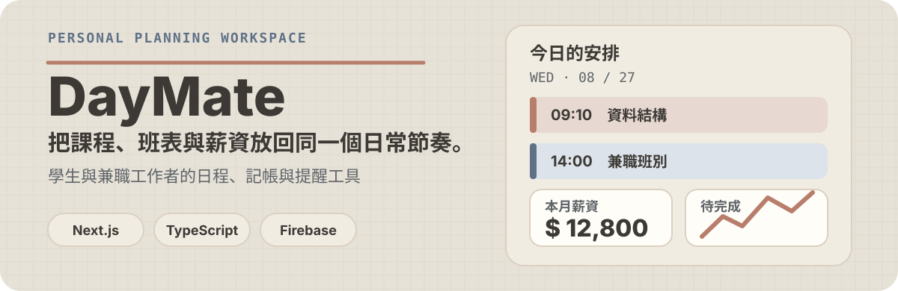

<p align="center">
  
</p>

<p align="center">
  <a href="https://nextjs.org/"></a>
  <a href="https://www.typescriptlang.org/"></a>
  <a href="https://firebase.google.com/"></a>
</p>

DayMate 是為學生與兼職工作者設計的日常管理工具。它將學校課表、打工月曆、薪資記錄、生活費與課程筆記集中在一個 App 中，讓每天要做什麼、何時上班、這個月賺了多少，都能在同一條工作流完成。

## 為什麼是 DayMate？

日程與薪資不是兩套互不相干的資料：班表會直接帶入薪資記錄，而首頁則把今日安排、事件與當月概況放在一起。登入後，一般資料依 Google 帳號分開保存；遊戲攻略才是家庭共用資料。未設定 Firebase 時，專案仍可正常建置。

```text
課表與班表 ──→ 今日儀表板 ──→ 薪資記錄與分析 ──→ Excel / PDF 報表
       │                  │
       └──→ Firestore 個人資料 ──→ 課程筆記、生活費與事件
                         └──→ 共用遊戲攻略（家庭成員可讀）
```

## 主要功能

### 規劃每天的節奏

- **學校課表**：以節次網格管理課程，支援跨節次呈現。
- **打工月曆**：按月查看、建立與編輯班別，主資料只屬於目前登入的 Google 帳號；指定帳號可同步班表摘要至 family-web。
- **首頁儀表板**：整合今天的課程與班別、近期事件、每月班表與統計概況。
- **課程筆記**：依課程整理筆記、作業與考試，追蹤截止日與完成狀態。

### 把班表轉成可用的薪資資料

- 以班別範本預填時段、時數與時薪；可從當月打工班表帶入薪資記錄。
- 提供明細、趨勢、工時與平均時薪分析，以及批次編輯與刪除。
- 支援 Excel 匯入與匯出、PDF 報表和列印。

### 補足生活與興趣記錄

- **生活費記錄**：管理支出資料與類別。
- **遊戲攻略中心**：建立、編輯並以版本與類型篩選攻略內容。
- **PWA**：提供可安裝的 Web App 設定與 Service Worker 快取。

## 技術與資料流

| 層次 | 使用方式 |
| --- | --- |
| 介面 | Next.js App Router、React 19、CSS Modules 與 CSS Variables |
| 資料 | Firebase Authentication（Google 登入）與 Firestore 即時訂閱 |
| 結構 | 頁面 → Custom Hooks → Firestore Service → 個人 `/users/{uid}/{collection}`；攻略 `/shared/data/gameGuides` |
| 匯出 | `xlsx`、`jspdf`、`html2canvas` |
| 部署 | GitHub Pages 靜態匯出（production base path：`/schedule_app`） |

## 快速開始

### 1. 安裝並啟動

```bash
npm install
npm run dev
```

開啟 [http://localhost:3000](http://localhost:3000)。

### 2. 設定 Firebase（選用）

若要使用 Google 登入與雲端資料，建立 `.env.local`：

```bash
NEXT_PUBLIC_FIREBASE_API_KEY=...
NEXT_PUBLIC_FIREBASE_AUTH_DOMAIN=...
NEXT_PUBLIC_FIREBASE_PROJECT_ID=...
NEXT_PUBLIC_FIREBASE_STORAGE_BUCKET=...
NEXT_PUBLIC_FIREBASE_MESSAGING_SENDER_ID=...
NEXT_PUBLIC_FIREBASE_APP_ID=...
```

`src/lib/firebase.ts` 會先檢查設定是否完整；未設定時不會初始化 Firebase，因此仍可執行靜態建置。

若要啟用 family-web 班表同步，另外設定以下 secondary Firebase 變數：

```bash
NEXT_PUBLIC_FAMILY_FIREBASE_API_KEY=...
NEXT_PUBLIC_FAMILY_FIREBASE_AUTH_DOMAIN=...
NEXT_PUBLIC_FAMILY_FIREBASE_PROJECT_ID=...
NEXT_PUBLIC_FAMILY_FIREBASE_STORAGE_BUCKET=...
NEXT_PUBLIC_FAMILY_FIREBASE_MESSAGING_SENDER_ID=...
NEXT_PUBLIC_FAMILY_FIREBASE_APP_ID=...
```

### 3. Firestore 資料權限

規則原始檔位於 [`firestore.rules`](./firestore.rules)。部署到目前使用的 Firebase 專案後，權限如下：

| 資料 | 家庭成員權限 |
| --- | --- |
| `/users/{自己的 UID}/courses`、`salaryRecords`、`workShifts`、`events`、`allowanceRecords`、`allowanceSourceTypes`、`shiftTemplates`、`courseNotes` | 只能讀寫自己的資料 |
| `/shared/data/gameGuides` | 家庭成員可讀；只有管理帳號可寫入 |
| family-web `/schedules` | 只同步 Brian 與 lovesweet 的班表摘要；標題分別加上「百頁」與「布丁」，不包含薪資欄位 |
| 其他所有路徑 | 禁止讀寫 |

舊版 `/shared/data/courses` 等個人資料不會被程式自動刪除或複製；若要保留，請先手動遷移到對應使用者的 `/users/{uid}/{collection}` 路徑，再部署新規則。

family-web 同步白名單如下：`brianlien09@gmail.com` →「百頁」、`lovesweet95170@gmail.com` →「布丁」。新增或編輯打工班表時會自動同步；打工月曆也提供按月重新同步按鈕，可用來補上既有班表的標題前綴。

### 4. 遷移舊版共用資料

可使用 [`scripts/migrate-shared-data.mjs`](./scripts/migrate-shared-data.mjs) 將舊的 `/shared/data/{collection}` 個人資料複製到 Brian 的 UID `R8kHfFPNvAhcqR5fErddUzHBNfJ2`。腳本預設只預覽，確認結果後才加上 `--apply`；它不會刪除來源資料，也不會遷移遊戲攻略。

請先建立具備 Firestore 存取權限的 service account JSON，並只放在本機。每次只指定真正擁有資料的 UID，避免把同一份私人資料複製給所有家人：

```bash
node scripts/migrate-shared-data.mjs --credentials <service-account.json> --project-id schedule-app-ed4c1
```

預覽結果正確後：

```bash
node scripts/migrate-shared-data.mjs --credentials <service-account.json> --project-id schedule-app-ed4c1 --apply
```

若只要遷移特定集合，可加入 `--collections courses,salaryRecords,workShifts`。完成個人資料遷移後，再由 Brian 或 lovesweet 登入打工月曆，使用月份同步按鈕建立 family-web 的「百頁／布丁」班表副本。

### 5. 檢查、建置或部署

```bash
npm run lint
npm run build
npm run deploy
```

## 專案結構

```text
src/
├── app/              # App Router 路由：首頁、日程、工具、資料管理與遊戲攻略
├── components/       # 可重用介面與薪資工具元件
├── context/          # Auth、Toast 與確認對話框狀態
├── data/             # 預設資料與 TypeScript 型別
├── hooks/            # 日程、薪資、筆記、生活費與攻略資料流程
├── lib/              # Firebase 初始化
├── services/         # Firestore 與 family-web 同步服務
└── utils/            # Excel 解析、ICS 匯出與衝突檢查
```

## 作者

由 [Brian Lien](https://github.com/BrianLien09) 維護。
